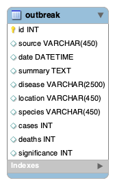

## EventTrackerProject

### Summary / Overview
This project is an outbreak tracker. It is currently a single table database with the potential to separate tables if further developed. The end vision for the project is a front end output to a map and table that can be filtered by date ranges and disease, with the ability to to overlay different diseases across different time periods on the same map.

### REST API Endpoints
| Action    |HTTP Verb| Resource URI        |       Action                   |
| ----------|---------|---------------------| -------------------------------|
| LIST      | GET     | /api/outbreaks      | Retrieve list of all outbreaks |
| READ      | GET     | /api/outbreaks/{id} | Retrieve a single outbreak     |
| CREATE    | POST    | /api/outbreaks      | Post a new outbreak            |
| REPLACE   | PUT     | /api/outbreaks/{id} | Replace an outbreak            |
| DELETE    | DELETE  | /api/outbreaks/{id} | Delete an outbreak             |

### Technologies Used
* Spring Rest API
* JPA/Hibernate/JPQL
* MySQL

### Deployed Application
http://3.130.50.134:8080/OutbreakTracker/api/outbreaks/

### Entity Diagram

